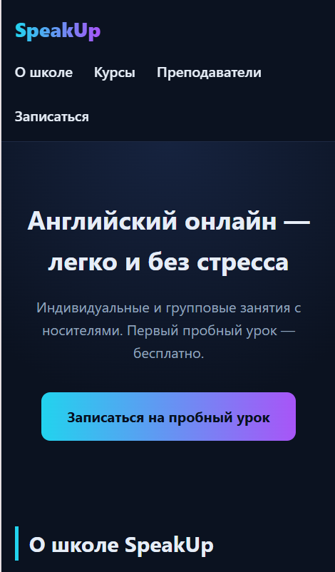
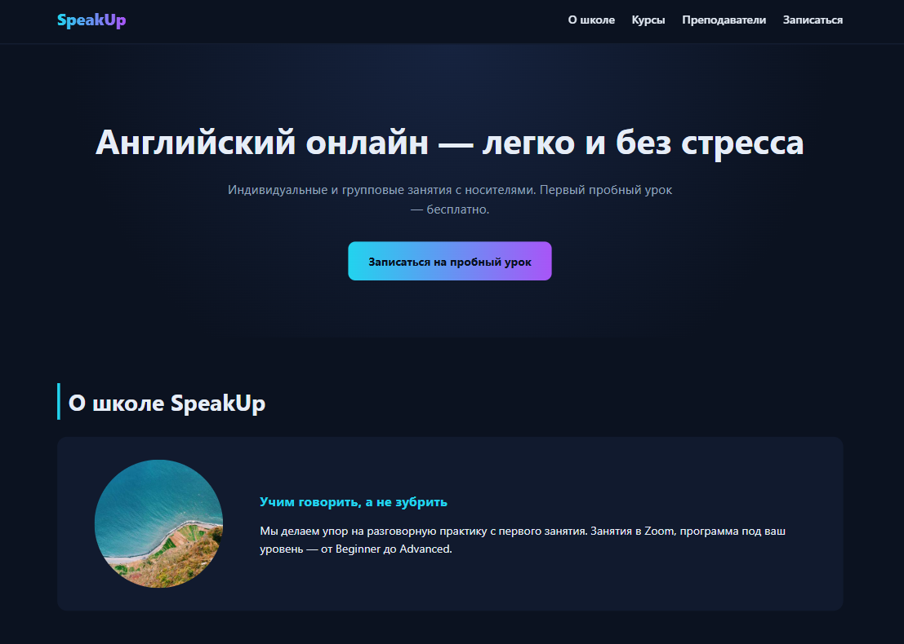

# landing-anarbaeva

**Тема:** Онлайн-школа английского языка SpeakUp.
**Автор:** Akerke Anarbaeva

## 🔗 Live (GitHub Pages)
https://akerkeanarbaeva2005-boop.github.io/landing-anarbaeva/

## Что сделано
- Семантические теги: header, nav, main, section, article, footer.
- 5 блоков: Hero, О школе, Курсы, Преподаватели, Записаться.
- Форма заявки (name, email, message) с label и required.
- Иерархия заголовков: h1 → h2 → h3.
- У всех изображений заполнен alt.
- В head: title, meta description, viewport, favicon.
- Адаптив на 375 px и 1280 px.
- Только HTML5 + CSS3, без фреймворков.

HTML5, CSS3 (Flexbox, Grid, переменные, media queries).

| 375 px (телефон) | 768 px (планшет) | 1280 px (десктоп) |
|---|---|---|
|  |  |  |

На телефоне меню переносится в две строки, карточки идут в один столбик. На планшете — по две карточки в ряд. На десктопе — по три. Горизонтальной прокрутки нет ни на одной ширине.

Я выбрала трек C — Sass + BEM. Sass удобен тем, что позволяет использовать переменные, миксины и вложенность: код становится короче и логичнее. Миксин respond() с картой брейкпоинтов избавляет от повторения одних и тех же медиазапросов. BEM помогает держать имена классов понятными: сразу видно, к какому блоку относится элемент.

Главный минус — Sass требует компиляции: GitHub Pages не собирает .scss, поэтому приходится держать в репозитории собранный style.css рядом с исходником. Это лишний шаг по сравнению с обычным CSS.

От других треков Sass отличается тем, что не приносит готовых классов, как Tailwind или Bootstrap — всю логику ты пишешь сама, но с удобствами языка. По сравнению с чистым CSS (трек D) Sass даёт больше возможностей для организации больших проектов.
ChatGPT — для генерации структуры и объяснения синтаксиса Sass.
